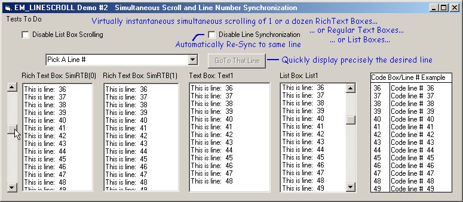



## AutoScroll EM\_LINESCROLL Demo

### Description

This small very fast code demonstrates the use of EM_LINESCROLL (sendmessage api)to to automatically, instantly, precisely, and simultaneously scroll 1 or several RichText, Text box, or List boxes. If you build chat interfaces, or are building a code editor... this code is for you! Even the rankest beginner will be able to understand and use this code in minutes. There's more comments than code!

I got the idea while using KRYO_11's external scroll bar code (found here on PSC). His code uses the EM_SCROLL message and a for/next loop that works fine for small text boxes... but goes a little nutty when the text box is tall and there are many lines to scroll.

The EM_LINESCROLL message does not "Scroll" to the new position... it jumps there similar to the GoTo statement in VB. It is VERY FAST!

I needed this yesterday... but couldn't find it anywhere... even a text search of PSC's code returned only one instance of a chat bot that didn't appear to really use the EM_LINESCROLL message... so if there is ANY similar code on PSC, it is well hidden indeed!

The project contains 2 demos:

1) Compares the EM_SCROLL and EM_LINESCROLL messages and speed of their use.

2) This demo simultaneously scrolls several RTBs, a text box and a list box from 1 regular old VB scrollbar. It will also teach you how to sync up the objects so they not only scroll together... but scroll the right lines together... and quickly.

Hope You Enjoy The Code!

CptnVic
 
### More Info
 
You must drag the scrollbars

Even the newest to coding will be able to follow this code.

Scrolled text

It's bug free or I wouldn't submit it!

             |
---                |---
**Submitted On**   |2006-03-10 12:48:46
**By**             |[CptnVic](https://github.com/Planet-Source-Code/PSCIndex/blob/master/ByAuthor/cptnvic.md)
**Level**          |Intermediate
**User Rating**    |5.0 (20 globes from 4 users)
**Compatibility**  |VB 4\.0 \(32\-bit\), VB 5\.0, VB 6\.0
**Category**       |[Windows API Call/ Explanation](https://github.com/Planet-Source-Code/PSCIndex/blob/master/ByCategory/windows-api-call-explanation__1-39.md)
**World**          |[Visual Basic](https://github.com/Planet-Source-Code/PSCIndex/blob/master/ByWorld/visual-basic.md)
**Archive File**   |[AutoScroll1979193102006\.zip](https://github.com/Planet-Source-Code/cptnvic-autoscroll-em-linescroll-demo__1-64606/archive/master.zip)

### API Declarations

Private Declare Function SendMessageBynum&amp; Lib "user32" Alias "SendMessageA" (ByVal hwnd As Long, ByVal wMsg As Long, ByVal wParam As Long, ByVal lParam As Long)

